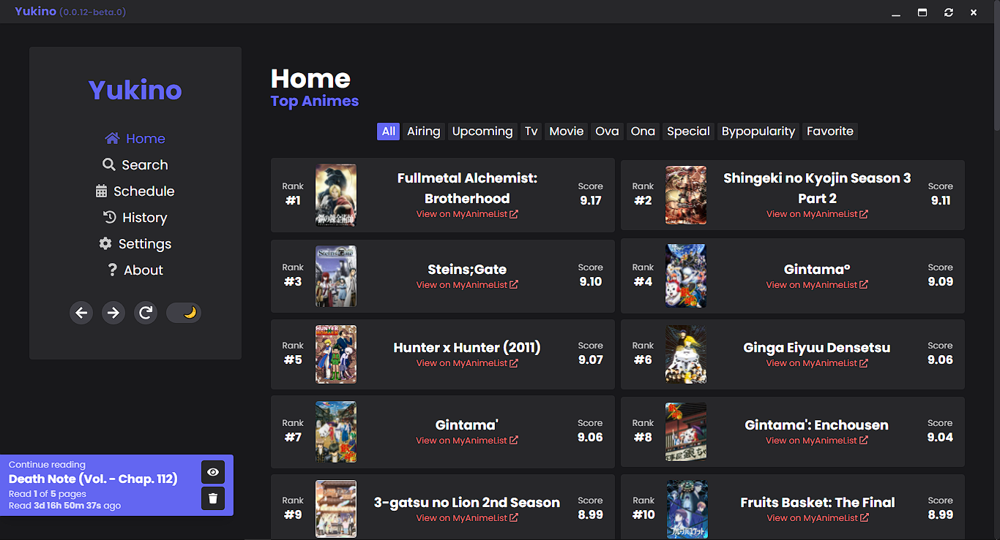

<br />

<p align="center">
    
</p>

# Yukino

Yukino lets you read manga or stream anime ad-free from multiple sources. The project's name "Yukino" meaning "Snow" named after the character "Yukino Yukinoshita" from the anime "Yahari Ore no Seishun Love Comedy wa Machigatteiru".

We do not support piracy nor run/serve any illegal or copyrighted contents, everything is acquired from third-party sources. The developer of this application does not have any affiliation with any of the third-party sources.

[](https://GitHub.com/zyrouge/yukino-app/releases/) [](https://GitHub.com/zyrouge/yukino-app/releases/) [](https://github.com/zyrouge/yukino-app/actions/workflows/Deploy.yml) [](https://github.com/zyrouge/yukino-app/actions/workflows/codeql-analysis.yml) [.yml/badge.svg?branch=main>)](<https://github.com/zyrouge/yukino-app/actions/workflows/Publish%20(Electron).yml>) [.yml/badge.svg>)](<https://github.com/zyrouge/yukino-app/actions/workflows/Publish%20(Capacitor%20-%20Android).yml>) [](https://www.codefactor.io/repository/github/zyrouge/yukino-app/overview/next)

## Download

You can download the latest version of app from the [releases](https://github.com/zyrouge/yukino-app/releases) tab.

## Preview



> All previews available at [https://zyrouge.github.io/yukino-app/](https://zyrouge.github.io/yukino-app/)

## Links

-   [Website](https://zyrouge.github.io/yukino-app/)
-   [User guide](https://zyrouge.github.io/yukino-app/guides)
-   [Discord](https://zyrouge.github.io/yukino-app/discord)
-   [GitHub](https://github.com/zyrouge/yukino-app)
-   [Patreon](https://patreon.com/zyrouge)

## Branding

### Colors

[](https://img.shields.io/badge/Indigo-%236366F1-white.svg?color=6366F1) [](https://img.shields.io/badge/Indigo-%236366F1-white.svg?color=6366F1)

## Technology

-   [Node.js](https://nodejs.org) (JavaScript Runtime)
-   [Typescript](https://www.typescriptlang.org/) (TypeScript compiler)
-   [Yarn](https://yarnpkg.com/) (Package manager)
-   [Vue](https://vuejs.org/) (Framework)
-   [Vite](https://vitejs.dev) (Builder)
-   [Electron](https://electronjs.org) (Desktop app)
-   [Capacitor](https://capacitorjs.com) (Mobile app)
-   [PostCSS](https://postcss.org/) (CSS compiler)
-   [Tailwind CSS](https://tailwindcss.com/) (Styling)

## Code structure

-   [./src](./src) - Core vue app (SPA)
-   [./environments](./environments)
    -   [./electron](./environments/electron) - Electron-related files (Windows, Linux, MacOS)
    -   [./capacitor](./environments/capacitor)
        -   [./android](./environments/capacitor/android) - Capacitor-related files (Android)
-   [./scripts](./scripts) - Required scripts
-   [./resources](./resources) - Required assets
-   [./screenshots](./resources) - App previews

## Under the hood

-   [anime-ext](https://zyrouge.github.io/anime-ext) - Fetches all the required data

## Contributing

Ways to contribute to this project:

-   Submitting bugs and feature requests in [issues](https://github.com/zyrouge/yukino-app/issues).
-   Opening [pull requests](https://github.com/zyrouge/yukino-app/pulls) containing bug fixes, new features, etc.

## Developer guide

### Cloning & Installing

```bash
git clone https://github.com/zyrouge/yukino-app.git
cd yukino-app
yarn
```

### Running the app in development

```bash
yarn vite:dev # Vite
yarn electron:dev # Electron
# No hot reload for Capacitor
```

### Building the app in development

```bash
yarn vite:build # Vite
yarn electron:build # Electron
yarn capacitor:android:build # Capacitor (android)
```

## License

[MIT](./LICENSE)
